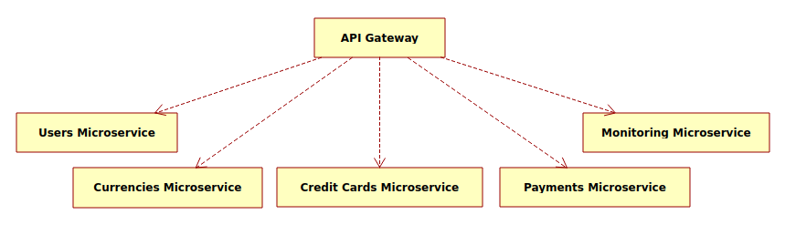
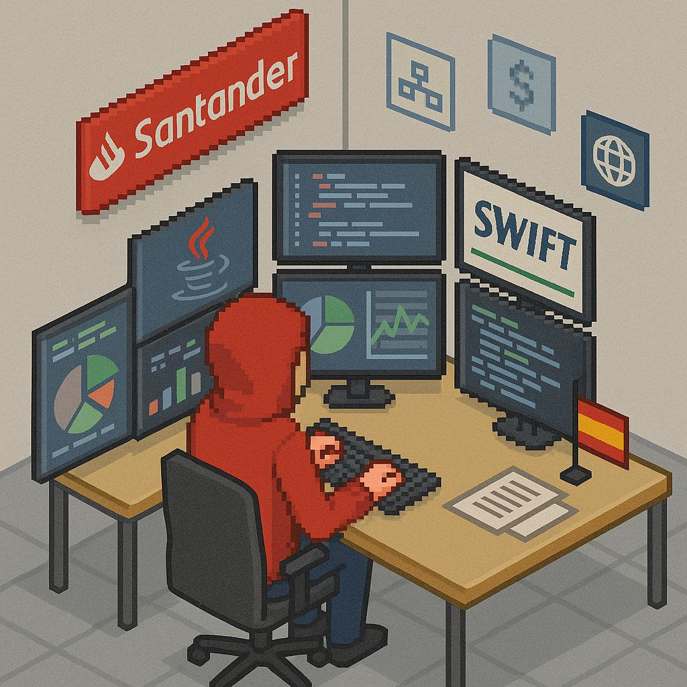

# Java API Gateway Microservice

    

    
    
    
    

### Overview

This microservice acts as the API Gateway for the system, routing and managing requests 
to downstream microservices such as User, Credit Card, and Order services. Built with 
Spring Cloud Gateway and WebFlux, it supports asynchronous routing, request filtering, 
and resiliency features like rate limiting, retries, and circuit breakers. It centralizes 
authentication, logging, and monitoring for all API traffic.

### Features
- **RESTful API**: Exposes endpoints for easy integration with other services and microservices.
- **Data Validation**: Ensures that credit card data is valid before processing.
- **Error Handling**: Provides meaningful error messages for invalid operations.
- **Logging**: Implements logging for monitoring and debugging purposes.
- **Security**: Implements basic security measures to protect sensitive credit card information.
- **Testing**: Includes unit and integration tests to ensure reliability and correctness.
- **Documentation**: Comprehensive API documentation for developers.
- **Containerization**: Docker support for easy deployment in various environments.
- **Versioning**: API versioning to manage changes and updates effectively.
- **User Authentication**: Integrates with authentication microservice to secure access to microservice of credit card.
- **Asynchronous Processing**: Uses WebFlux and supports asynchronous operations for improved responsiveness.
- **Rate Limiting**: Protects the microservice from abuse by limiting the number of requests from clients.

### Technologies Used
- Java
- Spring Boot
- Spring REST 
- Spring Security
- Spring WebFlux
- Spring Boot Actuator
- RabbitMQ/Kafka
- Resilience4j
- JWT
- Maven
- Swagger/OpenAPI
- Logback/SLF4J
- Micrometer
- Prometheus/Grafana
- Docker
- Spring Cloud Gateway

### Getting Started
#### Prerequisites
- Java Development Kit (JDK) 17 or higher
- Maven 4.0 or higher
- RabbitMQ/Kafka server (docker container is recommended)
- Docker (optional, for containerization)
- Git
- IDE (e.g., IntelliJ IDEA, Eclipse)
- cURL or Postman for API testing
- Monitoring tools (Prometheus, Grafana) 

